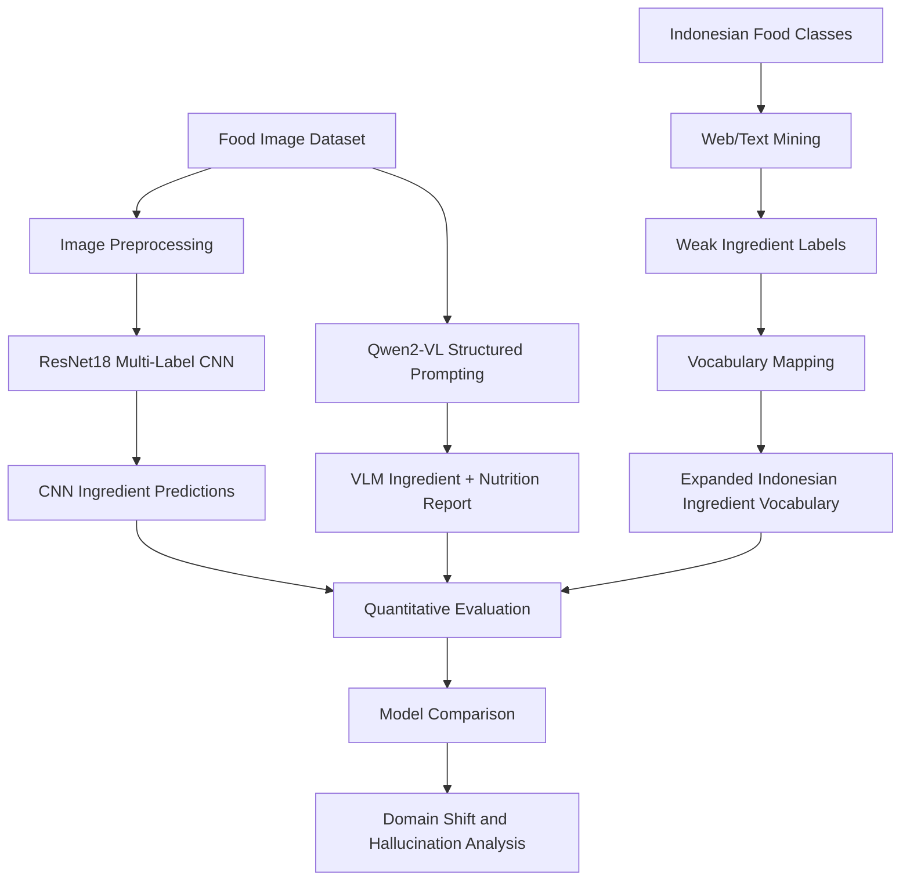

# Indonesian Food VLM Analyzer

A multimodal machine learning project for analyzing Indonesian food images using a CNN ingredient classifier, web-mined weak labels, and a Vision-Language Model (VLM). The project turns food images into structured ingredient and nutrition reports, then compares traditional computer vision against VLM-based reasoning.

This repository is designed as a portfolio-ready notebook project. The main goal is not only to classify food images, but also to evaluate how far a model can understand Indonesian dishes when the visual appearance, ingredient vocabulary, and web evidence are noisy or culturally specific.

---

## Project overview

Indonesian food is visually complex. Many dishes contain mixed ingredients, sauces, toppings, and preparation styles that are difficult to identify from images alone. A CNN can learn visual patterns from labeled data, but it often struggles when the target dishes contain ingredients outside its training vocabulary. A Vision-Language Model can reason more flexibly, but it may hallucinate ingredients or nutrition values.

This project studies that trade-off through an end-to-end pipeline:

1. Train a CNN baseline for multi-label ingredient prediction.
2. Test zero-shot transfer on Indonesian food images.
3. Mine weak ingredient labels from web/text evidence.
4. Expand the ingredient vocabulary for Indonesian food.
5. Use Qwen2-VL to produce structured ingredient and nutrition estimates.
6. Compare CNN and VLM predictions quantitatively.
7. Analyze hallucination, domain shift, and vocabulary mismatch.

---

## Core features

- **Multi-label ingredient classification** using a ResNet18 CNN baseline.
- **Threshold tuning** to improve micro-F1 on the validation set.
- **Zero-shot transfer analysis** from general recipe images to Indonesian food images.
- **Web/text mining** to generate weak ingredient labels for Indonesian dishes.
- **Vocabulary expansion** for Indonesian ingredients such as sambal, tempeh, tofu, coconut milk, lemongrass, turmeric, shrimp paste, and bay leaf.
- **Vision-Language Model prompting** using Qwen2-VL for structured ingredient and nutrition analysis.
- **CNN vs VLM comparison** on the same evaluation subset.
- **Few-shot prompting experiment** to test whether examples improve VLM ingredient extraction.
- **LoRA/PEFT smoke test** as an exploratory fine-tuning extension.
- **Hallucination analysis** to identify ingredients predicted by the VLM but not supported by weak labels.

---

## Pipeline



---

## Methods

### 1. CNN ingredient classifier

The baseline model uses **ResNet18** for multi-label ingredient classification. Since each food image can contain more than one ingredient, the task is treated as a multi-label problem instead of a single-class classification problem. The model output is converted into ingredient predictions using threshold tuning based on micro-F1.

### 2. Zero-shot Indonesian transfer

After training on the original recipe image dataset, the CNN is tested on Indonesian food images. This reveals a domain shift problem: the model often recognizes general visual cues, but struggles with local ingredients that are missing from the original vocabulary.

### 3. Web-mined weak supervision

To reduce manual labeling cost, the project mines ingredient evidence from recipe-like web/text data. These weak labels are noisy, but useful for evaluating whether the model can recover common ingredients for Indonesian food classes.

### 4. Vocabulary expansion

The original ingredient vocabulary is expanded with Indonesian food terms found during web/text mining. This improves coverage for local dishes and allows the evaluation to include ingredients that were previously treated as out-of-vocabulary.

### 5. Vision-Language Model analysis

Qwen2-VL is used as a structured food analyzer. Instead of asking a vague question, the notebook prompts the VLM to return a consistent report containing:

- food name
- visible ingredients
- estimated calories per 100g
- estimated macronutrients
- uncertainty notes

The structured output makes the VLM easier to evaluate against weak labels and easier to compare with the CNN baseline.

---

## Key results

| Experiment | Metric | Result |
|---|---:|---:|
| CNN validation after threshold tuning | micro-F1 | 0.3202 |
| Manual weak-label Indonesian transfer | micro-F1 | 0.1969 |
| Web-mined weak-label CNN with original vocabulary | micro-F1 | 0.0866 |
| Web-mined weak-label CNN with expanded vocabulary | micro-F1 | 0.1305 |
| CNN on Phase 4 VLM evaluation subset | micro-F1 | 0.0648 |
| Qwen2-VL on the same Phase 4 subset | micro-F1 | 0.4086 |
| Zero-shot structured VLM prompt | micro-F1 | 0.2750 |
| Few-shot structured VLM prompt | micro-F1 | 0.4086 |

### Main finding

The VLM performs better than the CNN on the selected Phase 4 subset because it can use visual-language reasoning and prior knowledge about food. However, the VLM also introduces a different risk: it may predict plausible ingredients that are not visibly confirmed or not present in the weak labels. This makes hallucination analysis important.

The CNN is more constrained and less flexible, but its predictions are easier to interpret as direct visual classification outputs. The VLM is more semantically powerful, but needs structured prompting and careful evaluation.

---

## Example output format

The VLM section is designed to produce structured output similar to this:

```json
{
  "food_name": "ayam goreng",
  "visible_ingredients": ["chicken", "oil", "garlic", "turmeric"],
  "estimated_calories_per_100g": 260,
  "macronutrients_per_100g": {
    "carbohydrate_g": 5,
    "protein_g": 22,
    "fat_g": 18
  },
  "uncertainty_notes": "Some spices are inferred from common preparation patterns and may not be visually confirmed."
}
```

Nutrition values are approximate model-generated estimates and should not be used as medical, dietary, or clinical advice.

---

## Repository structure

```text
indonesian-food-vlm-analyzer/
├── README.md
├── indonesian-food-vlm-data-analyzer.ipynb
├── requirements.txt
├── setup_guide.md
├── .gitignore
├── assets/
│   └── optional screenshots or diagrams
└── data/
    ├── dataset.md
    └── raw/                  # ignored by Git
```

The full datasets are not stored in this repository because image datasets and generated artifacts can be large. Dataset instructions are provided in `dataset.md`.

---

## How to run

### Recommended: Kaggle Notebook with GPU

The recommended way to run the full notebook is on Kaggle with GPU enabled.

1. Create a new Kaggle Notebook.
2. Upload or import `indonesian-food-vlm-data-analyzer-kaggle-ready.ipynb`.
3. Enable GPU acceleration from notebook settings.
4. Enable internet access if the notebook needs to download models or datasets.
5. Attach the required Kaggle datasets.
6. Run the notebook from top to bottom.

Kaggle is recommended because the VLM section is resource-heavy and can be slow or impractical on a CPU-only laptop.

### Optional: local environment

Local execution is possible for data exploration, CNN experiments, and notebook review. Full VLM inference is only recommended if the device has a compatible NVIDIA GPU.

```bash
python -m venv .venv
```

Windows PowerShell:

```powershell
.\.venv\Scripts\Activate.ps1
```

macOS/Linux:

```bash
source .venv/bin/activate
```

Install dependencies:

```bash
python -m pip install --upgrade pip setuptools wheel
pip install -r requirements.txt
```

Start Jupyter:

```bash
jupyter lab
```

More detailed setup instructions are available in `setup_guide.md`.

---

## Dataset access

This project uses public Kaggle food image datasets and web/text-mined weak labels. The datasets are not included in this repository due to size and licensing considerations.

Expected local structure:

```text
data/raw/
├── food-ingredients-and-recipes/
├── food-classification/
└── food-recipes/
```

On Kaggle, attach the datasets directly to the notebook and adjust the path resolver if needed.

---

## Skills demonstrated

- Computer vision
- Multi-label classification
- Transfer learning
- Weak supervision
- Web/text mining
- Vision-Language Model prompting
- Model evaluation
- Domain shift analysis
- Hallucination analysis
- PyTorch training workflow
- Hugging Face Transformers
- Kaggle notebook experimentation

---

## Portfolio summary

Built an end-to-end multimodal ML pipeline for Indonesian food image analysis. The project combines a ResNet18 multi-label CNN, web-mined weak labels, expanded Indonesian ingredient vocabulary, and Qwen2-VL structured prompting to predict food ingredients and estimate nutrition. The final analysis compares CNN and VLM performance, showing that VLMs can improve ingredient recall on Indonesian dishes while also requiring hallucination checks and careful evaluation.

---

## Limitations

- Weak labels from web/text mining may be noisy or incomplete.
- Nutrition estimates are approximate and generated by the model.
- VLM predictions may include plausible but visually unsupported ingredients.
- Full VLM inference requires GPU acceleration for practical runtime.
- The project is intended for research and portfolio demonstration, not production dietary guidance.

---

## Suggested GitHub topics

```text
computer-vision
vision-language-models
food-analysis
multilabel-classification
web-mining
nutrition-estimation
pytorch
kaggle
qwen-vl
weak-supervision
```